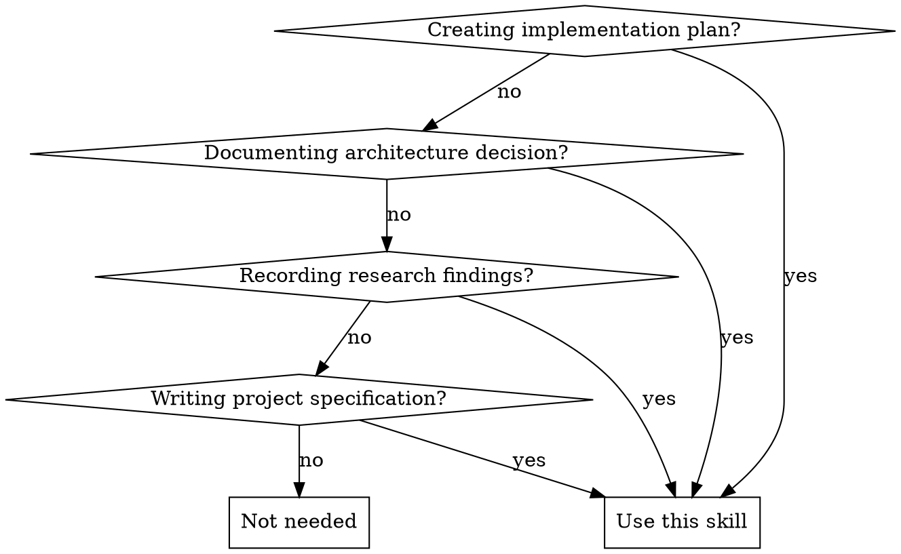

# Obsidian Knowledge Management

## Overview

**Knowledge capture in a searchable vault.** This skill guides you to proactively create Obsidian notes for important decisions, plans, and research that should persist beyond the current conversation. Unlike code comments or READMEs that live in a single repository, Obsidian notes create a cross-project knowledge base that's searchable, linkable, and accessible from anywhere.

## When to Use



**Use when:**
- Exiting plan mode with complex implementation plans
- Making architectural decisions (ADRs)
- Discovering important patterns during research/exploration
- Documenting complex bug investigations and root causes
- Creating project specifications or requirements docs

**Don't use for:**
- Code comments or inline documentation
- READMEs that belong in the repository
- API reference documentation adjacent to code
- Trivial notes or temporary scratchpad content
- Simple bug fixes without broader learnings

## The Core Pattern

**Before**: Knowledge lives only in conversation history
- Agent exits plan mode → plan disappears
- Agent finds root cause → investigation context lost
- User asks "why did we decide X?" → no record

**After**: Knowledge persists in searchable vault
- Implementation plan → Obsidian note linked from project
- Architecture decision → ADR in vault, searchable forever
- Research findings → Note with context, rationale, alternatives considered

## Quick Reference

| Task | Command | Example |
|------|---------|---------|
| **Check installed** | `which obsidian-cli` | Verify tool exists |
| **Create note** | `obsidian-cli create <name> --vault <vault> --content "..."` | Create plan note |
| **Search notes** | `obsidian-cli search` | Fuzzy find by title |
| **Search content** | `obsidian-cli search-content <term>` | Find text in notes |
| **Print note** | `obsidian-cli print <name>` | Read existing note |
| **Daily note** | `obsidian-cli daily` | Create/open today's note |

## Implementation Workflow

### Step 1: Verify Installation

**ALWAYS check first:**
```bash
which obsidian-cli
```

**If not installed:**
```
I notice you don't have obsidian-cli installed. This tool enables me to create
persistent, searchable documentation for implementation plans, architecture
decisions, and research findings across all your projects.

Install via Homebrew:
    brew install yakitrak/tap/obsidian-cli

After installation, set your default vault:
    obsidian-cli set-default <your-vault-name>

Would you like to install it, or should I proceed without creating persistent
documentation?
```

### Step 2: Check Default Vault

```bash
obsidian-cli print-default
```

If no default vault set, prompt user to configure:
```
Please set your default Obsidian vault:
    obsidian-cli set-default <vault-name>

Or specify --vault flag with each command.
```

### Step 3: Create Organized Notes

**Naming convention:**
- Temporal notes: `YYYY-MM-DD-brief-description` (e.g., `2026-01-30-auth-refactor-plan`)
- Reference notes: `topic-based-name` (e.g., `authentication-architecture`)

**Organization structure:**
```
VaultRoot/
├── ProjectName/
│   ├── plans/
│   │   └── 2026-01-30-feature-x-implementation.md
│   ├── architecture/
│   │   └── authentication-decision.md
│   ├── research/
│   │   └── performance-investigation-2026-01.md
│   └── specs/
│       └── feature-x-requirements.md
```

**Example: Creating implementation plan from plan mode**
```bash
obsidian-cli create "MyProject/plans/2026-01-30-user-export-plan" \
  --vault "MainVault" \
  --content "$(cat <<'EOF'
# User Export Feature Implementation Plan

## Context
User story: As a user, I need to export my data for GDPR compliance.

## Architecture
- New endpoint: GET /api/users/:id/export
- CSV serialization using existing serializer pattern
- Database query joins user + profile + orders tables

## Implementation Steps
1. Add database query with proper JOINs
2. Implement CSV serializer
3. Create endpoint with auth middleware
4. Add tests for edge cases (no data, partial data)

## Trade-offs
- **CSV vs JSON**: Chose CSV for Excel compatibility
- **Sync vs Async**: Sync for now (small datasets), async if needed later

## Dependencies
- None (uses existing auth and DB infrastructure)

## Testing Strategy
- Unit tests: CSV serialization edge cases
- Integration tests: Full endpoint with auth
- Manual test: Verify GDPR requirements met

Created: 2026-01-30
Status: Ready for implementation
EOF
)"
```

### Step 4: Link Between Notes

Use Obsidian's wiki-link syntax in note content:
```markdown
Related to [[authentication-architecture]]
Implements requirement from [[product-roadmap-2026]]
```

This creates navigable knowledge graph across projects.

## Common Mistakes

| Mistake | Why It's Wrong | Fix |
|---------|----------------|-----|
| **Skip installation check** | Tool not available, command fails | Always `which obsidian-cli` first |
| **Create notes for trivial content** | Clutters vault, low signal-to-noise | Only for significant decisions/plans |
| **Duplicate repo documentation** | Information in two places, gets out of sync | README in repo, decisions/plans in Obsidian |
| **Poor naming** | Notes not findable via search | Use descriptive, searchable names |
| **No project organization** | Vault becomes messy dump | Use ProjectName/category/ structure |
| **Forget to create note** | Knowledge lost after conversation ends | Proactively create before exiting plan mode |

## Red Flags - Create a Note

These situations mean you should create an Obsidian note:

- **"I've finished planning this feature"** → Create plan note before exiting plan mode
- **"We chose approach X because Y"** → Create ADR documenting decision
- **"After investigating, I found the root cause is Z"** → Create research note with findings
- **"This architecture will enable future extensions"** → Document architecture decision
- **"Here's how we'll implement this complex feature"** → Create spec note with details

**All of these mean: Create persistent documentation.**

## Real-World Example

**❌ Wrong approach:**
```
Agent: "I've created a comprehensive implementation plan for the user export
feature. Here it is: [5 paragraphs of detailed planning]. Ready to implement?"

User: "Great, let's do it!"
Agent: [Implements feature over next hour]

[2 weeks later]
User: "Why did we choose CSV over JSON for exports?"
Agent: "I don't have that context from previous conversations."
```

**✅ Right approach:**
```
Agent: "I've created a comprehensive implementation plan for the user export
feature. Let me save this to your Obsidian vault for future reference."

[Checks obsidian-cli installed]
[Creates note: MyProject/plans/2026-01-30-user-export-plan.md]

Agent: "Implementation plan saved to Obsidian at
MyProject/plans/2026-01-30-user-export-plan.md. This documents our decision
to use CSV for Excel compatibility, the architecture approach, and testing
strategy. Ready to implement?"

[2 weeks later]
User: "Why did we choose CSV over JSON for exports?"
Agent: [Reads note via obsidian-cli print]
"According to the implementation plan note, we chose CSV for Excel compatibility
and GDPR user-friendliness. The note also mentions we can add JSON export later
if needed."
```

## Decision Tree: Obsidian vs Repository Docs

```
Is this documentation?
├─ YES → What kind?
│   ├─ API reference / code usage → README.md in repo
│   ├─ Setup instructions → README.md in repo
│   ├─ Architecture decision → Obsidian ADR
│   ├─ Implementation plan → Obsidian plan note
│   ├─ Research findings → Obsidian research note
│   └─ Project requirements → Obsidian spec note
└─ NO → Regular code/comments
```

**Rule of thumb**: If it explains "what/how to use" → Repo. If it explains "why we decided" → Obsidian.

## Integration with Existing Preferences

This skill complements your configuration preferences:

- **"Detailed Explanations"**: Obsidian notes persist explanations beyond conversation
- **"Use Plan Mode Often"**: Create Obsidian note when exiting plan mode
- **"Tool Verification"**: Always check `which obsidian-cli` before use
- **"Proactive Documentation"**: Create notes for major decisions without being asked

## Quick Start Checklist

Before using obsidian-cli:
- [ ] Verify installed: `which obsidian-cli`
- [ ] Check default vault: `obsidian-cli print-default`
- [ ] Identify note type (plan/architecture/research/spec)
- [ ] Use descriptive, searchable name
- [ ] Organize in ProjectName/category/ structure
- [ ] Include context, decisions, and rationale in content
- [ ] Create note proactively at natural breakpoints (exiting plan mode, finishing research)
