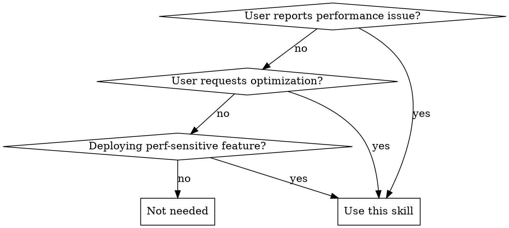
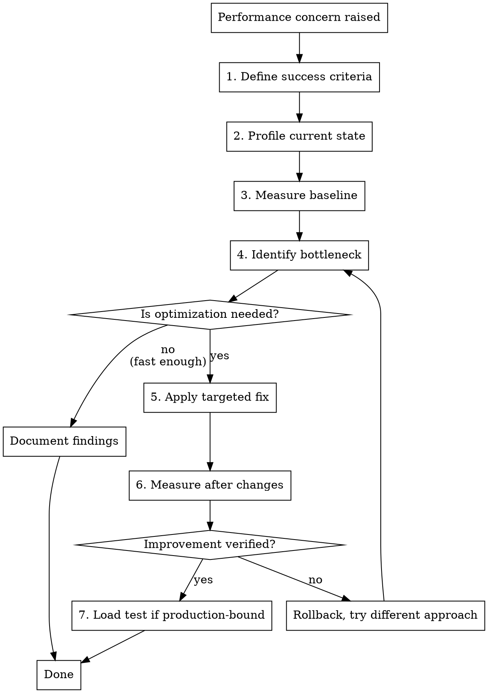

# Performance Engineering

## Overview

**Performance work without measurement is guesswork.** Always profile first, establish baselines, then optimize. The goal is to make systems measurably faster, not just apply optimizations.

## When to Use



**Use when:**
- Performance problems reported ("slow", "high latency", "timing out")
- Optimization explicitly requested
- Deploying batch processing, data pipelines, or high-throughput features
- Load/scale concerns raised
- Memory or CPU issues mentioned

**Don't use for:**
- Code review without performance context
- Features with no performance requirements
- Exploratory prototyping

## The Iron Law

```
NO OPTIMIZATION WITHOUT PROFILING FIRST
```

**No exceptions:**
- Not for "obvious" problems (N+1 queries, missing indexes)
- Not when "we already know the issue"
- Not when "user is waiting"
- Not when "it's clearly the bottleneck"

Even obvious problems need measurement to:
1. Confirm they're actually the bottleneck
2. Establish baseline for improvement measurement
3. Verify the fix actually helps
4. Avoid fixing wrong thing

## Performance Engineering Workflow



### Step 1: Define Success Criteria

**Before any profiling, establish:**
- Current performance metrics (latency, throughput, resource usage)
- Target performance goals (specific numbers, not "faster")
- Performance budget (acceptable limits)

**Questions to ask:**
- What's the current response time/throughput?
- What's the target response time/throughput?
- What's the acceptable maximum (p95, p99)?
- What resources are constrained (CPU, memory, I/O, network)?

**Example:**
```
Current: API endpoint averages 800ms (p95: 1200ms)
Target: <200ms average, <500ms p95
Budget: Database queries <100ms, external API calls <50ms
```

### Step 2: Profile Current State

**Choose profiling tool based on bottleneck type:**

**Application CPU/Memory:**
- Rust: `cargo flamegraph`, `perf record`
- Node: `node --prof`, `clinic doctor`, Chrome DevTools
- Python: `cProfile`, `py-spy`, `memory_profiler`
- Java: JProfiler, VisualVM, `async-profiler`
- Go: `pprof` (CPU and heap profiling)

**Database:**
- PostgreSQL: `EXPLAIN ANALYZE`, `pg_stat_statements`
- MySQL: `EXPLAIN`, slow query log
- General: Query logging with timing

**Network/I/O:**
- `strace` (system calls)
- `tcpdump` / Wireshark (network traffic)
- Application-level tracing (OpenTelemetry, Jaeger)

**Production profiling:**
- Use sampling profilers (low overhead)
- Enable APM tools (DataDog, New Relic, etc.)
- Check existing metrics dashboards first

### Step 3: Measure Baseline

**Run realistic workload and record metrics:**
- Response time (average, p50, p95, p99)
- Throughput (requests/second, operations/second)
- Resource usage (CPU %, memory, connections)
- Error rate

**Example measurement:**
```bash
# HTTP endpoint
ab -n 1000 -c 10 http://localhost:3000/api/users
# Or: wrk, hey, k6

# Database query
psql -c "EXPLAIN ANALYZE SELECT * FROM users WHERE active = true;"

# Application profiling
node --prof app.js
clinic doctor -- node app.js
```

**Document baseline:**
```
Before optimization:
- Average response: 823ms
- p95: 1247ms
- Database query: 645ms (78% of total time)
- Memory: 245MB
- CPU: 34% average
```

### Step 4: Identify Bottleneck

**Analyze profiling data to find actual bottleneck:**

**Common bottlenecks:**
- Database: Slow queries, N+1 queries, missing indexes, full table scans
- I/O: Disk reads, network latency, external API calls
- CPU: Inefficient algorithms, unnecessary computation
- Memory: Large allocations, memory leaks, garbage collection
- Concurrency: Lock contention, thread pool exhaustion

**Profile data reveals:**
- Time spent (flame graphs show function call time)
- Query execution plans (EXPLAIN shows table scans, index usage)
- Resource usage (which resource is saturated)

**Example analysis:**
```
Flame graph shows:
- 78% time in database query
- 15% time in JSON serialization
- 7% time in business logic

Bottleneck: Database query (missing index on active column)
```

### Step 5: Apply Targeted Fix

**Optimize only the identified bottleneck:**

**Database optimizations:**
- Add indexes for filtered/joined columns
- Rewrite N+1 queries as JOINs or batch queries
- Use query result caching
- Add database connection pooling
- Partition large tables

**Application optimizations:**
- Cache expensive computations
- Use lazy loading / pagination
- Optimize algorithms (O(n²) → O(n log n))
- Parallelize independent operations (with concurrency limits)
- Reduce memory allocations

**I/O optimizations:**
- Batch network requests
- Use async I/O
- Implement request coalescing
- Add CDN for static assets
- Compress responses

**Example fix:**
```sql
-- Before: Missing index causes table scan
SELECT * FROM users WHERE active = true;

-- Add index
CREATE INDEX idx_users_active ON users(active);

-- After: Index scan instead of table scan
```

### Step 6: Measure After Changes

**Run same workload as baseline:**
- Same tool, same parameters, same dataset
- Compare directly to baseline metrics

**Example verification:**
```bash
# Run same test
ab -n 1000 -c 10 http://localhost:3000/api/users

After optimization:
- Average response: 124ms (85% improvement)
- p95: 198ms (84% improvement)
- Database query: 12ms (98% improvement)
- Memory: 247MB (no change)
- CPU: 18% average (47% reduction)
```

**Success criteria:**
- ✅ Meets or exceeds target performance
- ✅ No regression in other metrics
- ✅ Improvement is consistent across runs

### Step 7: Load Test (Production-Bound Features)

**Required before production deployment:**

**When load testing is mandatory:**
- New features handling user-generated content
- Batch processing or background jobs
- Features with unbounded concurrency
- Database schema changes on large tables
- External API integrations

**Load test scenarios:**
1. **Normal load**: Expected traffic (100 uploads/hour → ~2/min)
2. **Peak load**: 3-5x normal (500 uploads/hour → ~8/min)
3. **Spike load**: 10x normal (1000 uploads/hour → ~17/min)
4. **Sustained load**: Peak load for 10+ minutes

**What to measure:**
- Response times under load (p50, p95, p99)
- Error rates (target: <0.1% under normal load)
- Resource usage (CPU, memory, disk, network)
- Database connection pool usage
- Queue depths (if applicable)

**Tools:**
- HTTP: `k6`, `artillery`, `wrk`, `ab`, `hey`
- Database: `pgbench`, `sysbench`
- Custom: JMeter, Gatling

**Example load test:**
```javascript
// k6 load test
import http from 'k6/http';
import { check, sleep } from 'k6';

export let options = {
  stages: [
    { duration: '2m', target: 10 },  // Ramp to normal load
    { duration: '5m', target: 10 },  // Sustain normal load
    { duration: '2m', target: 50 },  // Ramp to peak load
    { duration: '5m', target: 50 },  // Sustain peak load
    { duration: '2m', target: 0 },   // Ramp down
  ],
  thresholds: {
    http_req_duration: ['p(95)<500'], // p95 < 500ms
    http_req_failed: ['rate<0.01'],   // Error rate < 1%
  },
};

export default function() {
  let response = http.post('http://localhost:3000/api/batch', payload);
  check(response, { 'status is 200': (r) => r.status === 200 });
  sleep(1);
}
```

**Red flags in load testing:**
- Response times increase linearly with load (scaling problem)
- Error rates spike at peak load (capacity problem)
- Memory grows unbounded (memory leak)
- Database connections exhausted (pooling problem)

## Common Optimization Patterns

**Only apply AFTER profiling confirms the bottleneck.**

| Pattern | Use When | Example |
|---------|----------|---------|
| **Indexing** | Database queries scan many rows | `CREATE INDEX idx_users_email ON users(email)` |
| **Query batching** | N+1 queries identified | Replace loop of queries with single JOIN |
| **Caching** | Same expensive computation repeated | Cache query results, computed values |
| **Pagination** | Returning large result sets | `LIMIT 20 OFFSET 0` with pagination |
| **Lazy loading** | Loading unused data | Defer loading until needed |
| **Connection pooling** | Creating connections repeatedly | Reuse database/HTTP connections |
| **Concurrency limits** | Unbounded parallelism | Limit to 10-20 concurrent operations |
| **Async I/O** | Blocking I/O operations | Use async/await for I/O |
| **Compression** | Large response payloads | gzip/brotli compression |
| **Algorithm optimization** | CPU-bound computation | O(n²) → O(n log n) algorithm |

## Performance Debugging Workflow

**When performance problem is unclear:**

1. **Reproduce the issue**: Can you trigger the slowness reliably?
2. **Add timing instrumentation**: Log timestamps at key points
3. **Profile with sampling**: Capture what code is executing during slowness
4. **Check system resources**: Is CPU, memory, disk, or network saturated?
5. **Review recent changes**: Did performance degrade after a deploy?
6. **Check external dependencies**: Are external APIs slow?
7. **Analyze logs**: Look for error patterns, retry storms, cascading failures

**Example instrumentation:**
```typescript
const start = Date.now();
const users = await db.query('SELECT ...');
console.log(`Query took ${Date.now() - start}ms`);

const transformStart = Date.now();
const transformed = transform(users);
console.log(`Transform took ${Date.now() - transformStart}ms`);

console.log(`Total: ${Date.now() - start}ms`);
```

## Common Mistakes

| Mistake | Why It's Wrong | Fix |
|---------|----------------|-----|
| **Optimizing without profiling** | You're guessing at the bottleneck | Always profile first |
| **Fixing "obvious" problems first** | Obvious ≠ actual bottleneck | Let profiling data guide you |
| **No baseline measurement** | Can't prove improvement | Measure before changes |
| **Micro-optimizations** | Optimizing 1% while ignoring 70% bottleneck | Focus on biggest bottleneck first |
| **Deploying without load testing** | Production surprises (OOM, timeouts) | Load test before deploying |
| **Unbounded concurrency** | `Promise.all(1000 items)` exhausts resources | Limit to 10-20 concurrent |
| **Premature optimization** | Adding complexity without need | Only optimize when too slow |
| **Not measuring after** | Don't know if optimization worked | Always measure before/after |

## Red Flags - STOP and Profile First

These thoughts mean you're about to violate the Iron Law:

- "This is obviously the bottleneck" → Profile to confirm
- "It's clearly an N+1 query" → Measure to verify it's the slowest part
- "We don't have time to profile" → Profiling takes minutes, wrong fix takes hours
- "Just add an index" → Profile might show query isn't the bottleneck
- "Let's optimize this function" → Profile might show it's not called often
- "The user is waiting" → Fast wrong fix wastes more time than slow right fix
- "I can see the problem in the code" → Profile shows you what's actually slow

**All of these mean: Profile first. No exceptions.**

## Real-World Example

**Problem**: API endpoint slow (reported by user)

**❌ Wrong approach:**
```
User: "The /api/users endpoint is slow"
Developer: "I see the code - it's missing an index. Let me add one."
[Adds index, response time barely improves]
[Actual bottleneck was JSON serialization, not database]
```

**✅ Right approach:**
```
User: "The /api/users endpoint is slow"
Developer: "Let me profile to identify the bottleneck"

1. Define criteria:
   Current: 800ms average
   Target: <200ms average

2. Profile:
   - Added timing instrumentation
   - Ran profiler (clinic doctor)

3. Baseline measurement:
   - Database query: 120ms (15%)
   - JSON serialization: 650ms (81%)
   - Other: 30ms (4%)

4. Bottleneck identified: JSON serialization
   - Using JSON.stringify on large objects
   - Nested objects being serialized multiple times

5. Applied fix:
   - Implement streaming JSON serialization
   - Remove nested redundant data

6. Measured after:
   - Database query: 120ms (same)
   - JSON serialization: 45ms (93% improvement)
   - Total: 180ms average (78% improvement)

7. Load test:
   - Normal load (10 req/s): p95 < 250ms ✓
   - Peak load (50 req/s): p95 < 400ms ✓
   - Error rate: <0.01% ✓
```

## Quick Reference

**Before optimizing:**
- [ ] Performance criteria defined (current, target, budget)
- [ ] Profiling tool chosen and run
- [ ] Baseline measurements recorded
- [ ] Bottleneck identified from profile data

**During optimization:**
- [ ] Fix targets identified bottleneck (not "obvious" problem)
- [ ] Change is minimal and focused
- [ ] No premature abstractions or over-engineering

**After optimization:**
- [ ] Same workload measured (before/after comparison)
- [ ] Improvement verified (meets success criteria)
- [ ] No regressions in other metrics
- [ ] Load tested if production-bound

**Production deployment:**
- [ ] Load tested at normal, peak, and spike loads
- [ ] Error rates acceptable under load
- [ ] Resource usage (CPU, memory, connections) within limits
- [ ] Monitoring and alerts configured
