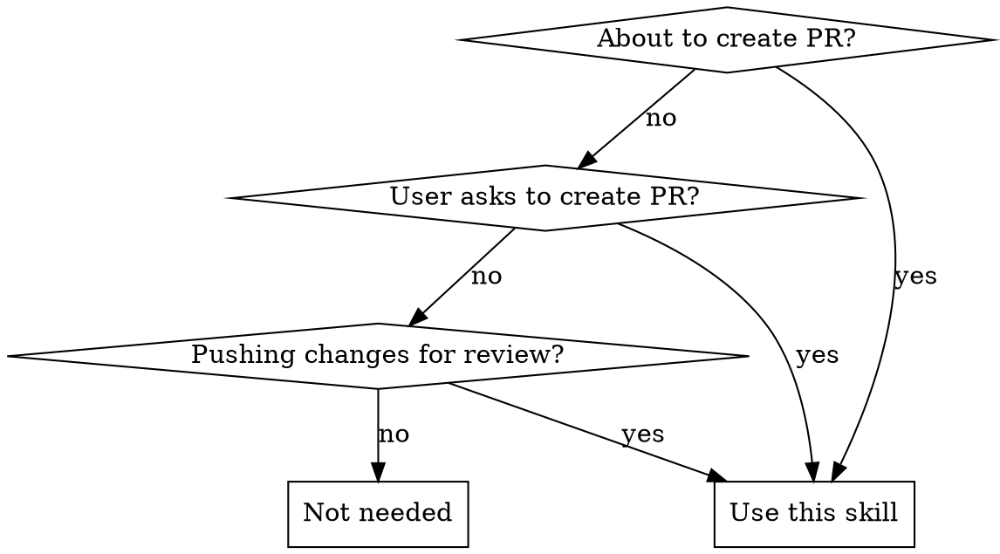
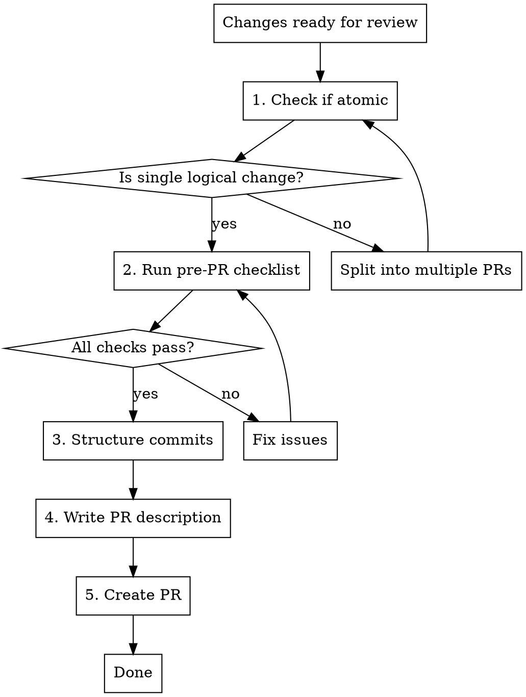

# Pull Request Creation

## Overview

**Pull requests should be atomic**: one logical change per PR. Atomic PRs are easier to review, safer to merge, and simpler to revert. The goal is focused, reviewable changes that tell a clear story.

## When to Use



**Use when:**
- Creating pull requests
- User asks to push changes for review
- Preparing code for team review
- Before running `gh pr create`

**Don't use for:**
- Exploratory work not ready for review
- Research or investigation tasks
- Local commits (not going to PR)

## The Atomic PR Principle

```
ONE LOGICAL CHANGE PER PR
```

**Atomic PR means:**
- Single responsibility (one feature, one bug fix, one refactor)
- All changes serve the same purpose
- Can be reviewed independently
- Can be reverted without affecting other work
- Tells a clear story in git history

**NOT atomic:**
- Feature + refactoring in same PR
- Multiple unrelated bug fixes
- "While I was there" changes
- Mixing dependency updates with features

## PR Creation Workflow



### Step 1: Check if Atomic

**Ask these questions:**

1. **Single purpose?** Does this PR do one thing?
2. **Independent?** Can this be reviewed/merged without other changes?
3. **Minimal?** Is everything in this PR necessary for the stated purpose?
4. **Focused?** Would removing any file make the PR incomplete?

**Red flags (split the PR):**
- "Added feature X and also refactored Y"
- "Fixed bug A and improved performance of B"
- "Updated dependencies and added new endpoint"
- Diff >500 lines (unless unavoidable, like generated code)
- Changes touch >10 files (unless tightly related)

**Example of splitting:**

❌ **Large PR**: "Add user export + refactor database pooling + update logging"
- 10 files changed, 800 lines
- Three separate concerns
- Hard to review, risky to merge

✅ **Split into atomic PRs**:
1. PR #1: "Refactor database connection pooling" (5 files, 300 lines)
2. PR #2: "Add user data export endpoint" (3 files, 200 lines)
3. PR #3: "Improve database query logging" (2 files, 100 lines)

Each can be reviewed, merged, and reverted independently.

### Step 2: Pre-PR Checklist

**REQUIRED before creating PR:**

**Verification:**
- [ ] All tests pass (`cargo test`, `pnpm test`, `pytest`, etc.)
- [ ] Linting passes (`cargo clippy`, `pnpm lint`, `ruff check`, etc.)
- [ ] No console.log or debug prints left in code
- [ ] No commented-out code (unless explicitly discussed)
- [ ] Formatter run (`cargo fmt`, `go fmt`, etc.)

**Git state:**
- [ ] Branch is up to date with base branch (main/master)
- [ ] No merge conflicts
- [ ] CI is passing on current branch (if CI exists)

**Code quality:**
- [ ] Code follows project conventions
- [ ] Error messages are helpful and actionable
- [ ] Edge cases are handled
- [ ] No security vulnerabilities (SQL injection, XSS, etc.)

**Run checklist commands:**

```bash
# Tests and linting (adjust for your language)
cargo test && cargo clippy -- -D warnings  # Rust
pnpm test && pnpm lint                      # Node/TS
pytest && ruff check .                      # Python
go test ./... && golangci-lint run          # Go

# Git state
git fetch origin
git diff origin/main...HEAD  # See what will be in PR
git status                   # Check for uncommitted changes

# CI status (if exists)
gh pr checks  # For existing PR
# Or check CI workflow status on current branch
```

**If any check fails:**
- Fix the issue before creating PR
- Don't create PR with failing tests
- Don't skip linting errors

### Step 3: Structure Commits

**Good commit structure:**
- Each commit is a logical unit
- Commits tell a story (reviewer can follow progression)
- Each commit could theoretically be merged alone (if makes sense)

**Example commit progression:**

```
commit 3: Add user export endpoint tests
commit 2: Implement user export endpoint
commit 1: Add user export database query
```

**When to squash:**
- "Fix typo" commits
- "Forgot to add file" commits
- "WIP" commits
- Back-and-forth changes that belong together

**When NOT to squash:**
- Distinct logical steps
- Changes that reviewers should see separately
- Migrations or schema changes (separate from code)

**Squashing example:**

❌ **Before** (messy):
```
commit 5: Fix typo in test
commit 4: Add tests
commit 3: Remove console.log
commit 2: Implement export
commit 1: Add export query
```

✅ **After** (clean):
```
commit 2: Add user export endpoint with tests
commit 1: Add user export database query
```

**Squash command:**
```bash
git rebase -i HEAD~5  # Interactive rebase last 5 commits
# Mark commits to squash with 's'
# Keep first commit as 'pick'
```

### Step 4: Write PR Description

**Use this template:**

```markdown
## Summary
[1-2 sentences: what does this PR do?]

## Changes
- [Bullet list of changes]
- [Be specific, not generic]

## Why
[Why was this change needed? What problem does it solve?]

## Test Plan
- [ ] Unit tests added/updated
- [ ] Manual testing: [describe what you tested]
- [ ] [Any specific testing instructions for reviewers]

## Screenshots / Demo (if applicable)
[For UI changes, include before/after or demo]

## Related Issues
Fixes #123
Related to #456
```

**Example good PR description:**

```markdown
## Summary
Add user data export endpoint to allow users to download their data in CSV format.

## Changes
- Add `GET /api/users/:id/export` endpoint
- Implement CSV serialization for user data
- Add export query with JOIN to include profile data
- Add tests for export endpoint and CSV formatting

## Why
Required for GDPR compliance - users must be able to export their personal data. This was requested in issue #342 and is a legal requirement before our EU launch.

## Test Plan
- [x] Unit tests for CSV serialization (5 test cases)
- [x] Integration test for export endpoint
- [x] Manual testing:
  - Exported data for test user, verified CSV format
  - Tested with user with no profile (empty fields handled correctly)
  - Verified all PII fields are included

## Related Issues
Fixes #342
```

**Example bad PR description:**

```markdown
Updates

Made some changes to the API
```

**Description quality checklist:**
- [ ] Clear summary (not "Updates" or "Changes")
- [ ] Specific changes listed (not "various improvements")
- [ ] Why explained (not just what)
- [ ] Test plan included (not "tested manually")
- [ ] Related issues linked

### Step 5: Create PR

**Use `gh` CLI:**

```bash
# Make sure you're on the right branch
git branch --show-current

# Push branch if not already pushed
git push -u origin feature/user-export

# Create PR with title and body
gh pr create \
  --title "Add user data export endpoint" \
  --body "$(cat <<'EOF'
## Summary
Add user data export endpoint for GDPR compliance...

[Full PR description from template]
EOF
)"

# Or interactively (gh will prompt for title/body)
gh pr create
```

**PR title guidelines:**
- **Keep short**: <70 characters
- **Use imperative mood**: "Add feature" not "Added feature"
- **Be specific**: "Add CSV export endpoint" not "Add export"
- **No PR number**: gh adds it automatically
- **Capitalize first word**: "Fix bug" not "fix bug"

**Example good PR titles:**
- ✅ "Add user data export endpoint for GDPR compliance"
- ✅ "Fix race condition in session cleanup"
- ✅ "Refactor database connection pooling"
- ✅ "Update dependencies: react 17 → 18"

**Example bad PR titles:**
- ❌ "Updates" (what updates?)
- ❌ "Fixed stuff" (what stuff?)
- ❌ "Added a feature for users to export their data in CSV format for GDPR compliance" (too long - use description)
- ❌ "adding export endpoint" (not imperative, not capitalized)

**After creating PR:**
```bash
# Check CI status
gh pr checks

# View PR in browser
gh pr view --web

# If CI fails, fix and push (PR updates automatically)
git add .
git commit -m "Fix test failure"
git push
```

## When to Split PRs

**Split if ANY of these are true:**

1. **Multiple concerns**: Feature + refactoring, or multiple unrelated fixes
2. **Large diff**: >500 lines (unless generated code or unavoidable)
3. **Multiple reviewers needed**: Backend + frontend changes needing different expertise
4. **Independent risks**: Changes that should be deployable separately
5. **Long review time**: >30 minutes to review (split for reviewer sanity)
6. **Mixed urgency**: Hotfix + nice-to-have improvement

**How to split:**

**Option 1: Split by concern** (preferred)
```bash
# Create separate branches for each concern
git checkout -b feature/export main
# Cherry-pick export commits
git cherry-pick <commit-hash>

git checkout -b refactor/db-pooling main
# Cherry-pick pooling commits
git cherry-pick <commit-hash>

# Create separate PRs
```

**Option 2: Sequential PRs** (if dependent)
```bash
# PR #1: Foundation (merge first)
git checkout -b feature/export-query main
# Commits for database query

# PR #2: Build on top (after PR #1 merges)
git checkout -b feature/export-endpoint feature/export-query
# Commits for endpoint using query
```

## PR Size Guidelines

| Size | Lines Changed | Files | Review Time | When Appropriate |
|------|---------------|-------|-------------|------------------|
| **Tiny** | <50 | 1-2 | 5 min | Bug fixes, typos, config changes |
| **Small** | 50-200 | 2-5 | 10-15 min | Most PRs (aim for this) |
| **Medium** | 200-500 | 5-10 | 20-30 min | Small features, refactors |
| **Large** | 500-1000 | 10-15 | 45-60 min | Avoid if possible (split) |
| **Huge** | >1000 | >15 | 2+ hours | Only if unavoidable (migrations, generated code) |

**Target**: Most PRs should be Small (50-200 lines).

**If PR is "Huge":**
- Can you split into smaller PRs?
- Is there generated code you can separate?
- Can you stage the change (PR #1: infrastructure, PR #2: feature)?

## Commit Message Quality

**Good commit messages:**
- **Concise**: 1-2 sentences
- **Focus on "why"**: Not just "what" (code shows what)
- **Imperative mood**: "Add feature" not "Added feature"
- **Context**: Why was this needed?

**Template:**
```
Add user export endpoint for GDPR compliance

Users must be able to download their personal data per GDPR Article 15.
Implements CSV export of user profile, orders, and preferences.

Co-Authored-By: Claude Sonnet 4.5 <noreply@anthropic.com>
```

**Example good commits:**
```
Fix race condition in session cleanup

Sessions were being deleted while still in use, causing 401 errors.
Add lock to prevent concurrent cleanup during active requests.

Co-Authored-By: Claude Sonnet 4.5 <noreply@anthropic.com>
```

```
Refactor database connection pooling

Extract pooling logic into separate module for reusability.
Increases max connections from 10 to 50 to handle peak load.

Co-Authored-By: Claude Sonnet 4.5 <noreply@anthropic.com>
```

**Example bad commits:**
```
fixes
```
```
WIP
```
```
Updated files
```

## Common Mistakes

| Mistake | Why It's Wrong | Fix |
|---------|----------------|-----|
| **Large PRs** | Hard to review, risky to merge, long feedback cycles | Split into atomic PRs (<200 lines each) |
| **Mixed concerns** | Can't merge independently, unclear git history | Separate feature, refactor, fixes into different PRs |
| **Vague descriptions** | Reviewers don't understand context | Use PR template with Why/What/How |
| **No test verification** | Broken code in PR, wastes reviewer time | Run tests and linting before creating PR |
| **Poor commit messages** | Hard to understand git history | Clear, concise messages with "why" |
| **"While I was there" changes** | Scope creep, violates atomic principle | Save unrelated improvements for separate PR |
| **Skipping CI checks** | Push broken code, CI failures block review | Verify CI passes before creating PR |

## Red Flags - Stop and Split

These thoughts mean you should split the PR:

- "I also refactored while I was there" → Separate PRs
- "This includes a few unrelated fixes" → Split into multiple PRs
- "The diff is large but it's all related" → If >500 lines, split anyway
- "I'll explain it in the description" → If needs long explanation, too complex
- "Reviewers can just skip parts they don't care about" → Wrong approach, split PRs
- "It's faster to merge it all at once" → False - large PRs take longer to review

**All of these mean: Split into multiple atomic PRs.**

## Real-World Example

**❌ Wrong approach:**
```
User: "I've added login, registration, password reset, and OAuth. Create a PR."
Developer: [Creates single PR with 1200 lines changed across 15 files]

PR title: "Add authentication"
PR description: "Added authentication features"

Result:
- 2-hour review time
- Multiple rounds of feedback (mixing concerns)
- Difficult to merge (conflicts with other work)
- Can't deploy login without OAuth (tightly coupled)
```

**✅ Right approach:**
```
User: "I've added login, registration, password reset, and OAuth. Create a PR."
Developer: "This is multiple features. Let me split into atomic PRs for easier review."

PR #1 (merge first): "Add session management infrastructure"
  - 3 files, 120 lines
  - Foundation for auth features
  - 15-minute review

PR #2 (depends on #1): "Add login and registration pages"
  - 4 files, 180 lines
  - Core auth flow
  - 20-minute review

PR #3 (depends on #2): "Add password reset flow"
  - 3 files, 140 lines
  - Self-contained feature
  - 15-minute review

PR #4 (depends on #2): "Add OAuth provider integration"
  - 5 files, 220 lines
  - Independent from password reset
  - 25-minute review

Result:
- Each PR: <200 lines, <30 min review
- Can merge/deploy incrementally
- Easy to revert if issues found
- Clear git history
```

## Quick Reference

**Before creating PR:**
- [ ] Changes are atomic (single logical purpose)
- [ ] All tests pass
- [ ] Linting passes
- [ ] No debug code left behind
- [ ] Branch up to date with main
- [ ] CI passing (if exists)

**PR structure:**
- [ ] Title: <70 chars, imperative, specific
- [ ] Description: Summary, Changes, Why, Test Plan
- [ ] Commits: Logical progression, clean history
- [ ] Size: <500 lines (split if larger)

**After creating PR:**
- [ ] CI checks pass
- [ ] Reviewers assigned (if needed)
- [ ] Linked to related issues
- [ ] Ready for review
